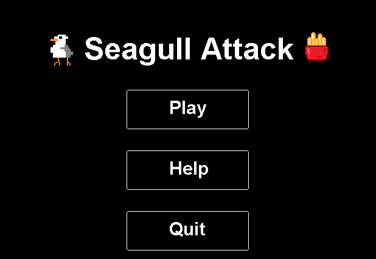
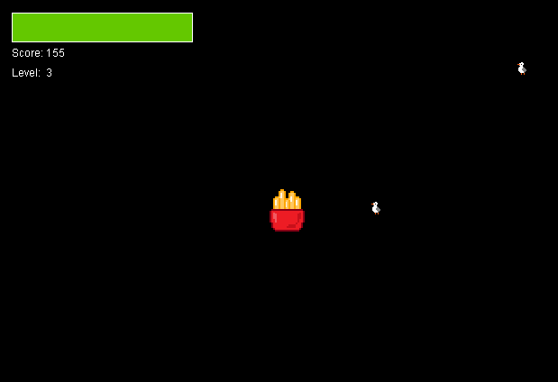

# Seagull Attack Game
This is a java based game where the user plays as a pack of fries while
a variety of seagulls try to eat them.
## Menu

## Game Play

## Levels
As the user progresses through the levels, the enemy seagulls become faster and
larger. Every ten levels a larger Seagull "Boss" must be defeated before moving on.

There are also health bonuses that occur at various levels that can restore the user's health.
